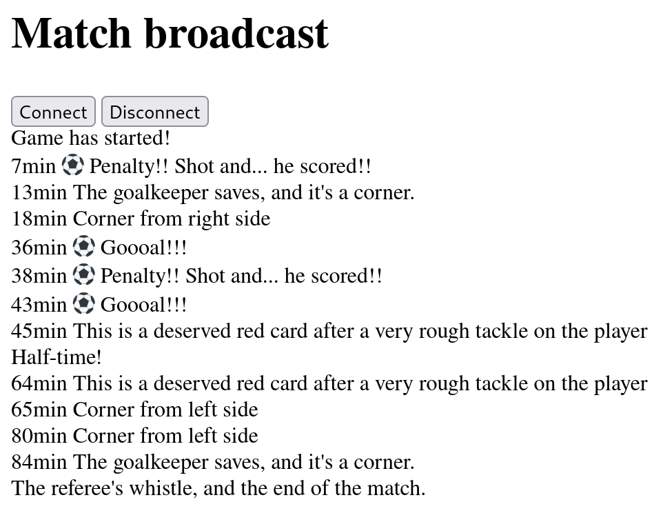

# Broadcast events from server

This repository implements Server Side Events for broadcasting events from a football match.

Events are simulated using algorithm.



## Installation

```bash
pipenv shell
pipenv install
```

## Usage

```bash 
pipenv shell
python run.py
```

navigate to localhost:8000 and click connect button

## License

This project is licensed under the terms of the MIT license.